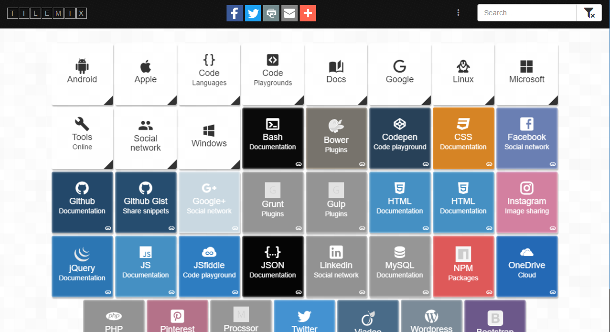

# TILEMIX

<!--
[](paypal.me/)

[](http://travis-ci.org/chrisbo246/tilemix)

[](https://coveralls.io/r/chrisbo246/tilemix?branch=master)
-->

[website](http://chrisbo246.github.io/tilemix/)

Filterable tiles builded from a public Google spreadsheet to link and remind about everything.



## Getting Started

These instructions will get you a copy of the project up and running on your local machine for development and testing purposes. See deployment for notes on how to deploy the project on a live system.

### Prerequisites

Install [Node](https://nodejs.org/en/download/) on your local machine then download dependencies.

```
npm install -g gulp-cli bower yo generator-webapp
```

### Installing

Install NPM and Bower required packages.

```
npm install
bower install
```

### Testing

```
gulp serve
```

[http://localhost:9000/](http://localhost:9000/)

## Deployment

```
gulp build
```

Then upload the **dist** directory content to your web server.

<!--
## Contributing

Please read [CONTRIBUTING.md](CONTRIBUTING.md) for details on our code of conduct, and the process for submitting pull requests to us.
-->

## Bugs

Please use the [GitHub issue tracker](https://github.com/chrisbo246/tilemix/issues) for all bugs and feature requests. Before creating a new issue, do a quick search to see if the problem has been reported already.

## Author

[chrisbo246](https://github.com/chrisbo246)

See also the list of [contributors](https://github.com/chrisbo246/tilemix/contributors) who participated in this project.

<!--
## License

This project is licensed under the MIT License - see the [LICENSE.md](LICENSE.md) file for details
-->
